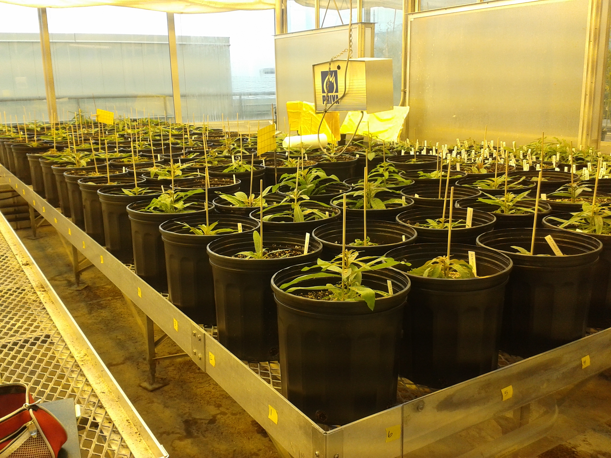

## Phenotypic Shifts in Neopolyploids

{: .align-right} Whole-genome duplication (WGD) can affect a host of plant traits.

## Reproductive Strategies in Clonal Plants

{: .align-left} stuff. 
 
 
{: .align-right} More stuff.

