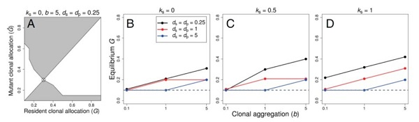

My research explores the evolution and ecology of polyploid plants in both natural populations and urban ecosystems, with an emphasis on interactions between whole-genome duplication (WGD), polyploidy, and reproductive strategies. I use a variety of quantitative approaches; combining field work, experiments, phylogenetic analysis, computational methods, and theoretical models.
 
 

{: .align-right} My research is motivated by two broad questions:
1. What are the eco-evolutionary causes and consequences of polyploidy?  
2. How do sexual and asexual reproduction via clonal growth interact, and how does investment in clonal reproduction affect fitness?   
 
 

# 1. Polyploid Evolution and Ecology in Natural and Urban Systems

What is polyploidy anyway? Polyploidy is the presence of more than two chromosome sets, and is remarkably common among plants; approximately 35% of extant flowering-plant species are polyploid, and __all__ have experienced at least one ancient whole-genome duplication (WGD) event. Despite its high frequency of occurrence in this group, the role of polyploidy in the ecology and evolution of plant species is understudied, especially in non-crop/non-model systems. I concentrate on the impact of phenotypic divergence between diploids and polyploids, in both natural populations and urban environments.

### Phenotypic Shifts in Neopolyploids

{: .align-right} Autopolyploids (polyploids arising within a single species) frequently exhibit divergent phenotypes from their diploid parents (e.g., plant size, see diploid vs. neotetraploid _Fragaria vesca_ on the right). Changes can happen immediately following the WGD event, or they may arise over many generations if cytotypes are subject to different selective pressures. But since newly arisen neo-polyploids are only rarely observed in nature, we often can't disentangle the short- vs. long-term effects of WGD on individual phenotypes. 
 
 
During my PhD at the University of Guelph, I used synthetic lab-generated neopolyploids in the first studies to to quantify the immediate effects of WGD on investment in clonal reproduction. I found that the effects of WGD on clonality differ both within ([Van Drunen & Husband 2018a](https://doi.org/10.1002/ajb2.1159 )), and between species ([Van Drunen & Husband 2018b](https://doi.org/10.1093/aob/mcy071)). Furthermore, patterns of clonal reproduction in naturally-occuring tetraploid _Chamerion angustifolium_ were more similar to diploids than to synthetic neotetraploids! These studies suggest that phenotypic effects of WGD are complex, context dependent, and may result in considerable variation among neopolyploids. 
 
 
Current research with _Mimulus guttatus_ is exploring the immediate effects of WGD on life history and phenological traits, using a pool of ~100 newly synthesized neopolyploid lines from annual and perennial populations across this species range.
 

### Reproduction, Life History Strategies, and Polyploid Establishment

{: .align-right} Polyploid establishment in diploid populations is constrained by Minority Cytotype Exclusion (MCE), where rare polyploids have low fitness relative to diploids because most of their mating opportunities are between-cytotype. Species with traits that help overcome MCE are expected to produce successful polyploids. Many traits have been postulated to alleviate MCE (e.g., self-fertilization, assortative mating, asexual reproduction), but the mechanisms behind success or failure in the establishment process have proven difficult, or impossible, to study in natural populations. In my research, I combine fieldwork with experimental, theoretical, and computational methods to obtain a fuller picture of the role of these strategies in polyploid establishment.
 
  
I am particularly interested in the impact of reproductive and life history strategies on polyploid success. Comparative phylogenetic analyses I conducted on a large angiosperm-wide data set ([Van Drunen & Husband 2019](https://doi.org/10.1111/nph.15999)) revealed variable evolutionary relationships between clonal reproduction and polyploidy across major clades, and further suggest that the relationship between these two traits is strongly confounded with perenniality. To follow up on this work, in my postdoc at Queen's University I developed agent-based simulation models with explicit spatial structure to evaluate the roles of clonal reproduction vs. life history in polyploid establishment ([Van Drunen & Friedman 2021](https://doi.org/10.1101/2021.10.21.465190); see figure on right). 
 
 

### Polyploids in Urban Environments
{: .align-right} Polyploidy is not evenly distributed among plant groups, nor are rates of WGD uniform across time. Many studies have linked bursts of WGDs to periods of climatic upheaval, such as the Cretaceous-Paleogene extinction, and have credited polyploidy as an important factor in the survival and success of plant lineages during and after these events. Currently, plants are facing new environmental challenges associated with anthropogenic change - few of which are more extreme than the development of densely urbanised human settlements. Considering polyploidy in the context of urbanisation provides a unique opportunity to observe polyploidy "in action", and may allow us to address fundamental questions in polyploid evolution and ecology that are difficult to study in natural populations.
 
 
Preliminary research on polyploid vs. diploid plant species occurrence across 30 parks in the city of Toronto (Canada) suggests that the proportion of polyploid species present increases with urbanisation, even when accounting for an increase in introduced/invasive species in urban areas. however, the ecological and evolutionary factors resulting in such a pattern are unknown. 
 
 

# Reproductive Strategies in Clonal Plants

### The Fitness Consequences of Clonality
The effect of clonality on sexual reproduction has traditionally been thought of as negative: it takes resources that could be invested in sex, and pollen transfer between shoots in the same clone can increase self-fertilization. But clonal reproduction is extremely common in plants (an estimated 50-75% of species), suggesting that investment in clonality must have fitness benefits in some situations. Because most mating occurs between near neighbours, the spatial architecture of clones should greatly influence sexual fitness (e.g., clones that have large spaces between shoots vs. densely packed shoots). 
 
 
In collaboration with Drs. Marcel Dorken and Mark van Kleunen, I developed numerical and simulation models to investigate how spatial patterns of clonal shoots influences fitness through pollen and seed production ([Van Drunen _et al._ 2015](https://doi.org/10.1073/pnas.1501720112)). We found that the spatial expansion of a clone can actually increase mating success and fitness by spreading the dispersal of pollen and seeds over a wide area, promoting between-clone mating (outcrossing) and seed germination. Surprisingly, models also showed that high clonal expansion is favoured under high inbreeding depression, and can result in lower rates of self-fertilization than previously assumed. Overall, our models suggest that higher investment in clonality (_G_, see figure below) can be an evolutionarily stable strategy when average seed and pollen dispersal distances (_d_s, _d_p)are short, shoots are not spatially aggregated (_b_), and - counterintuitively - when inbreeding depression (_k_s) is high.
 
 
{: .align-center}

### Trade-offs Between Reproductive Modes
Life history theory predicts that trade-offs between sexual and clonal reproduction (the vegetative production of genetically identical daughter plants) should occur because individuals have a finite pool of resources to allocate between reproductive modes. These allocation patterns have direct effects on fitness, and are often under strong selection pressure. However, due to intershoot resource sharing and division of labour in clonal plants, it can be unclear whether the resource trade-offs within single shoots are generally present at the level of the entire genetic individual. 
 
 
To measure resource trade-offs at the whole-clone level, during my MSc at Trent University I used _Sagittaria latifolia_ in a large common garden experiment where I manipulated investment in sexual reproduction in both dioecious (separate sexes) and hermaphroditic plants ([Van Drunen & Dorken 2012](https://doi.org/10.1111/j.1469-8137.2012.04260.x)). I found a 1:1 biomass trade-off between sexual and clonal reproduction at the whole-clone level, but only for female function (ovule and seed production). In contrast, male function (pollen production) decreased the nitrogen content of clonal propagules, suggesting that male function may subtract from future performance in the next growing season. The results of this experiment further inspired the theoretical paper [Dorken & Van Drunen 2018](https://doi.org/10.1111/jeb.13335); an example of the integration between theory and empirical work in my research. 
 


